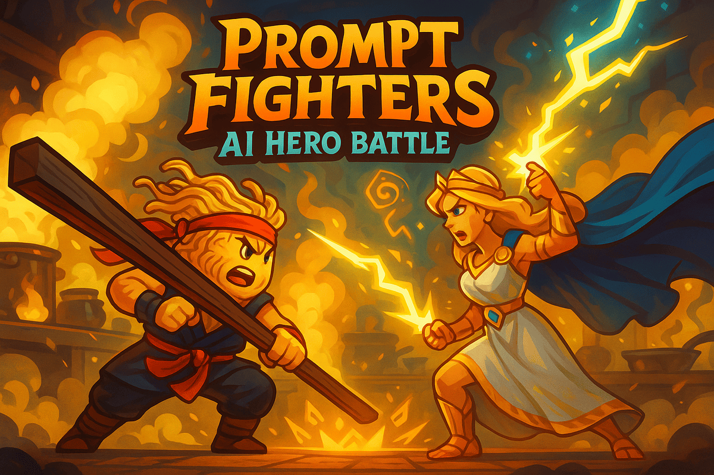

# Prompt Fighters ⚔️

一場由 AI 驅動的文字角色扮演戰鬥遊戲。在這裡，你可以創建你獨一無二的英雄，並讓他們在 AI 導演的史詩級戰鬥中一決高下！

<p align="center">
  
</p>

## ✨ 主要功能

- **Google 帳號快速登入**：使用您的 Google 帳號，一鍵進入遊戲世界。
- **AI 創造角色**：只需一個名字，AI 就能為你的英雄產生獨特的背景故事和初始能力。
- **動態戰鬥系統**：戰鬥過程並非預設腳本，而是由大型語言模型 (LLM) 根據角色屬性和戰鬥場景即時生成，每一場戰鬥都充滿驚喜。
- **戰鬥歷史與統計**：查看您所有英雄的詳細戰鬥歷史、勝率和統計數據。
- **前後端分離架構**：採用現代化的 Angular 前端與 Django 後端分離架構，響應快速、易於維護。
- **容器化部署**：整個後端環境使用 Docker 與 Docker Compose 進行容器化，確保開發與生產環境的一致性。

## 🛠️ 技術棧

- **後端**:
  - Python, Django, Django REST Framework
  - PostgreSQL (資料庫)
  - Redis & Celery (非同步任務處理)
  - Gunicorn (WSGI 伺服器)
  - Docker & Docker Compose
  - OpenAI API (GPT-4/GPT-3.5)
- **前端**:
  - TypeScript, Angular
  - Tailwind CSS (樣式框架)

## 🚀 本地開發環境啟動指南

請確保您的電腦已安裝以下軟體：
- [Docker](https://www.docker.com/get-started)
- [Node.js](https://nodejs.org/en/) (v18 或更高版本)
- [Angular CLI](https://angular.io/cli)

### 1. 取得專案

首先，複製此專案到您的本地電腦：
```bash
git clone https://github.com/your-username/ai-hero-battle.git
cd ai-hero-battle
```

### 2. 後端設定與啟動

後端所有服務皆由 Docker Compose 管理，啟動非常簡單。

**a. 設定環境變數**

進入 `backend` 資料夾，複製 `.env.example` 檔案為 `.env`。
```bash
cd backend
cp .env.example .env
```
然後，編輯 `.env` 檔案，填入您的個人金鑰：
- `SECRET_KEY`: Django 的密鑰，可以隨意設定一個長的隨機字串。
- `OPENAI_API_KEY`: 您的 OpenAI API 金鑰。
- `GOOGLE_CLIENT_ID`: 您的 Google OAuth Client ID。
- `GOOGLE_CLIENT_SECRET`: 您的 Google OAuth Client Secret。

**b. 啟動 Docker 容器**

在 `backend` 資料夾中，執行以下指令來建置並啟動所有後端服務（web, db, redis, celery）：
```bash
docker-compose up --build -d
```
後端服務將會在 `http://localhost:8000` 啟動。

### 3. 前端設定與啟動

**a. 安裝依賴**

進入 `frontend` 資料夾，安裝所有 npm 套件：
```bash
cd ../frontend
npm install
```

**b. 啟動開發伺服器**

執行以下指令：
```bash
ng serve
```
前端應用程式將會在 `http://localhost:4200` 啟動，並會自動代理 API 請求到後端的 `8000` 連接埠。

現在，您可以打開瀏覽器訪問 `http://localhost:4200` 開始遊戲！ 
