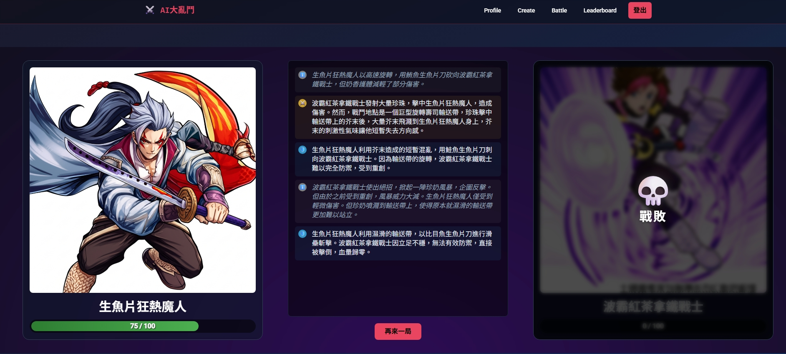
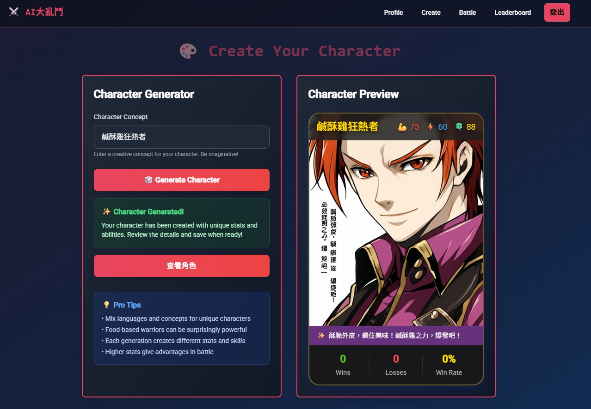
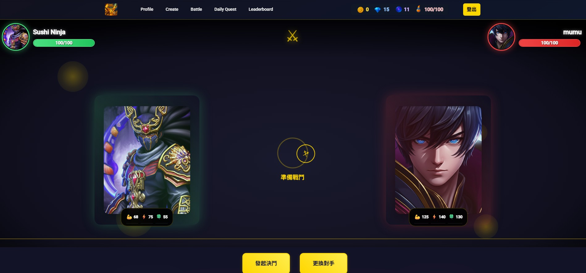
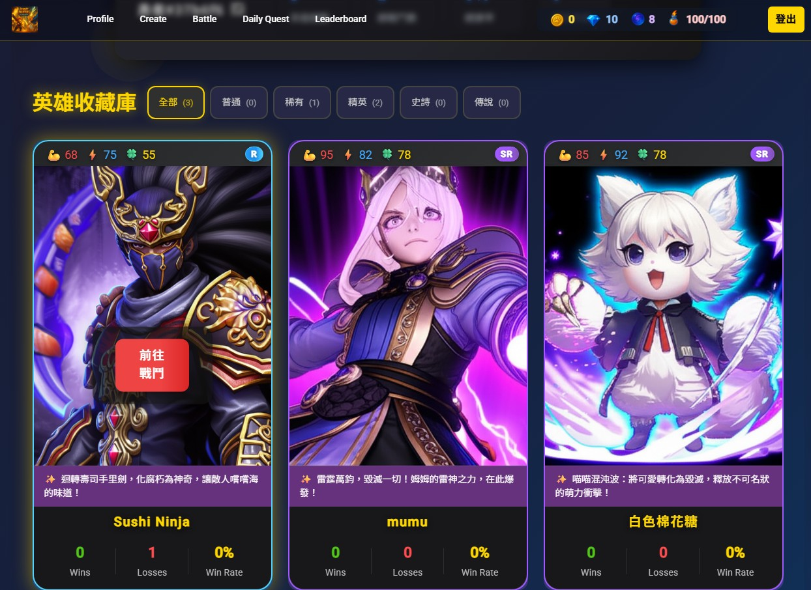

# Prompt Fighters ⚔️

一場由 AI 驅動的文字角色扮演戰鬥遊戲。在這裡，你可以創建你獨一無二的英雄，並讓他們在 AI 導演的史詩級戰鬥中一決高下！

<p align="center">
  
</p>

## 🎮 遊戲截圖

<p align="center">
  
  
  
  
</p>

## ✨ 主要功能

- **Google 帳號快速登入**：使用您的 Google 帳號，一鍵進入遊戲世界。
- **AI 創造角色**：只需一個名字，AI 就能為你的英雄產生獨特的背景故事和初始能力。
- **動態戰鬥系統**：戰鬥過程並非預設腳本，而是由大型語言模型 (LLM) 根據角色屬性和戰鬥場景即時生成，每一場戰鬥都充滿驚喜。
- **戰鬥歷史與統計**：查看您所有英雄的詳細戰鬥歷史、勝率和統計數據。
- **前後端分離架構**：採用現代化的 Angular 前端與 Django 後端分離架構，響應快速、易於維護。
- **容器化部署**：整個後端環境使用 Docker 與 Docker Compose 進行容器化，確保開發與生產環境的一致性。

## 🛠️ 技術棧

- **後端**:
  - Python, Django, Django REST Framework
  - PostgreSQL (資料庫)
  - Redis & Celery (非同步任務處理)
  - Gunicorn (WSGI 伺服器)
  - Docker & Docker Compose
  - OpenAI API (GPT-4/GPT-3.5)
- **前端**:
  - TypeScript, Angular
  - Tailwind CSS (樣式框架)

## 🚀 本地開發環境啟動指南

請確保您的電腦已安裝以下軟體：
- [Docker](https://www.docker.com/get-started)
- [Node.js](https://nodejs.org/en/) (v18 或更高版本)
- [Angular CLI](https://angular.io/cli)

### 1. 取得專案

首先，複製此專案到您的本地電腦：
```bash
git clone https://github.com/MuMuShy/PromptFighters.git
```

### 2. Google Identity Services 設定

本專案使用 Google Identity Services 進行用戶登入。

#### a. 建立 Google Cloud 專案

1. 前往 [Google Cloud Console](https://console.cloud.google.com/)
2. 建立新專案或選擇現有專案
3. 啟用 Google Identity API

#### b. 建立 OAuth 2.0 憑證

1. 在 Google Cloud Console 中，前往「API 和服務」→「憑證」
2. 點擊「建立憑證」→「OAuth 2.0 用戶端 ID」
3. 選擇應用程式類型：「網頁應用程式」
4. 設定授權重新導向 URI：
   - 開發環境：`http://localhost:4200`
   - 生產環境：`https://your-domain.com`
5. 記錄下 `Client ID`

#### c. 設定授權網域

在 OAuth 2.0 用戶端設定中，添加授權的 JavaScript 來源：
- 開發環境：`http://localhost:4200`
- 生產環境：`https://your-domain.com`

### 3. 前端設定

**修改 Client ID**

在 `frontend/src/app/login/login.component.ts` 第 85 行，將 `client_id` 替換為你的：

```typescript
g.accounts.id.initialize({
  client_id: 'YOUR_GOOGLE_CLIENT_ID_HERE', // 替換這裡
  callback: window.handleCredentialResponse,
  auto_select: false
});
```

### 4. 後端設定與啟動

**a. 設定環境變數**

進入 `backend` 資料夾，複製 `.env.example` 檔案為 `.env`。
```bash
cd backend
cp .env.example .env
```

然後，編輯 `.env` 檔案，填入您的個人金鑰：
```bash
# Django 設定
SECRET_KEY=your-django-secret-key-here

# GEMINI API 設定
GEMINI_API_KEY=your-openai-api-key-here
```

**重要提醒**：
- `SECRET_KEY`：可以使用 Django 的 `python manage.py shell -c "from django.core.management.utils import get_random_secret_key; print(get_random_secret_key())"` 生成

**b. 啟動 Docker 容器**

在 `backend` 資料夾中，執行以下指令來建置並啟動所有後端服務：
```bash
docker-compose up --build -d
```

這會啟動：
- **PostgreSQL 資料庫** (port 5432)
- **Redis** (port 6380)
- **Django Web 服務** (port 8000)
- **Celery Worker** (背景任務處理)

後端服務將會在 `http://localhost:8000` 啟動。

### 5. 前端設定與啟動

**a. 安裝依賴**

進入 `frontend` 資料夾，安裝所有 npm 套件：
```bash
cd ../frontend
npm install
```

**b. 啟動開發伺服器**

執行以下指令：
```bash
ng serve
```
前端應用程式將會在 `http://localhost:4200` 啟動，並會自動代理 API 請求到後端的 `8000` 連接埠。

### 6. 驗證設定

1. 打開瀏覽器訪問 `http://localhost:4200`
2. 點擊「使用 Google 登入」按鈕
3. 如果設定正確，應該會跳轉到 Google 登入頁面
4. 登入成功後會回到遊戲主頁面

## 故障排除

### Google 登入問題

**問題**：點擊登入按鈕沒有反應
- 檢查前端的 `client_id` 是否正確設定
- 確認授權重新導向 URI 是否包含 `http://localhost:4200`
- 檢查瀏覽器控制台是否有錯誤訊息

**問題**：登入後出現 401 錯誤
- 檢查後端服務是否正常運行
- 檢查 Django 日誌中的錯誤訊息
- 確認網路連接正常

**問題**：生產環境登入失敗
- 確認生產環境的網域已添加到 Google OAuth2 的授權網域
- 檢查 HTTPS 設定是否正確
- 確認前端的 `client_id` 設定正確

### 其他常見問題

**問題**：Docker 容器無法啟動
```bash
# 檢查容器狀態
docker-compose ps

# 查看容器日誌
docker-compose logs web

# 重新建置容器
docker-compose down
docker-compose up --build -d
```

**問題**：前端無法連接到後端
- 確認後端服務在 `http://localhost:8000` 運行
- 檢查 Angular 的代理設定
- 確認 CORS 設定是否正確

## 相關資源

- [Google Identity Services 官方文件](https://developers.google.com/identity/gsi/web)
- [Angular Google Sign-In 整合](https://developers.google.com/identity/sign-in/web/sign-in)

現在，您可以打開瀏覽器訪問 `http://localhost:4200` 開始遊戲！ 
